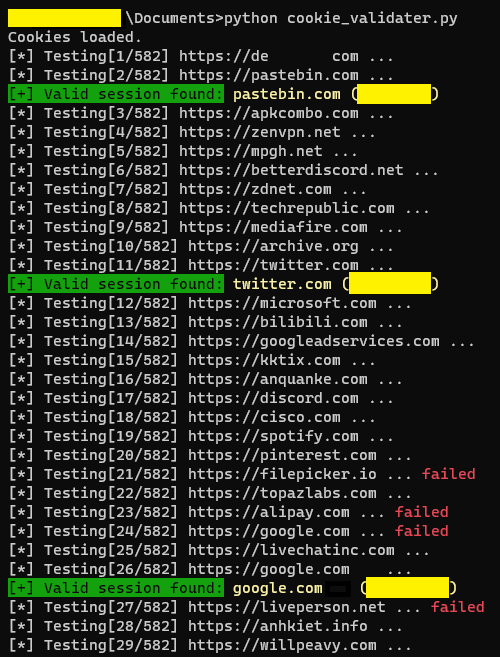

### Quick Start
1. Supports only Python >= 3.6
2. Install dependencies of the script
`pip install requests tldextract`
3. Export your cookies as JSON format to a secure location with [Cookiebro](https://chrome.google.com/webstore/detail/cookiebro/lpmockibcakojclnfmhchibmdpmollgn) (latest version is 2.17.1 at writing of this tool, use with caution)
4. Put the keywords that can be used for identifying a logged-in session. (i.e. can be found in the HTML of a logged-in session) (e.g. nickname)
5. Run the script by
`python cookie-validator.py`

### Screenshots
